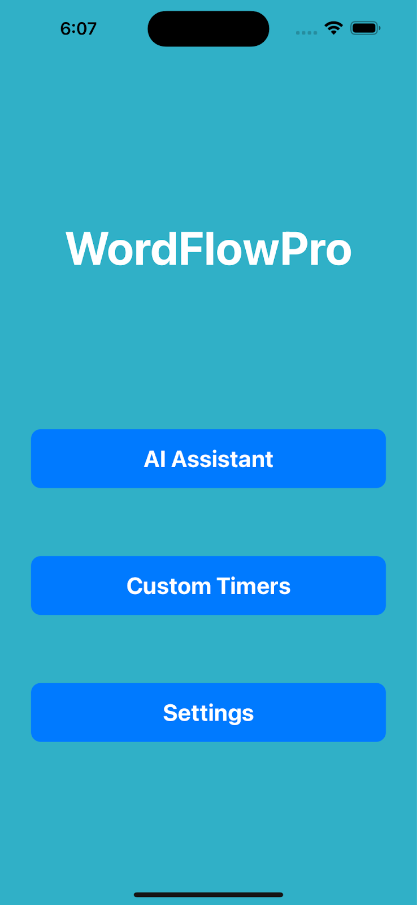
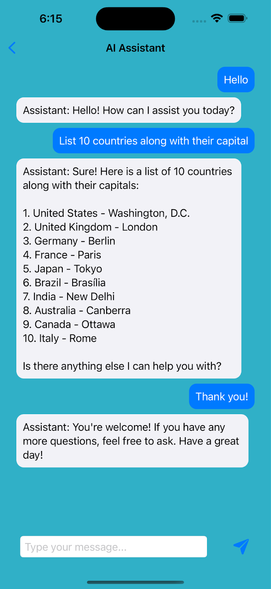
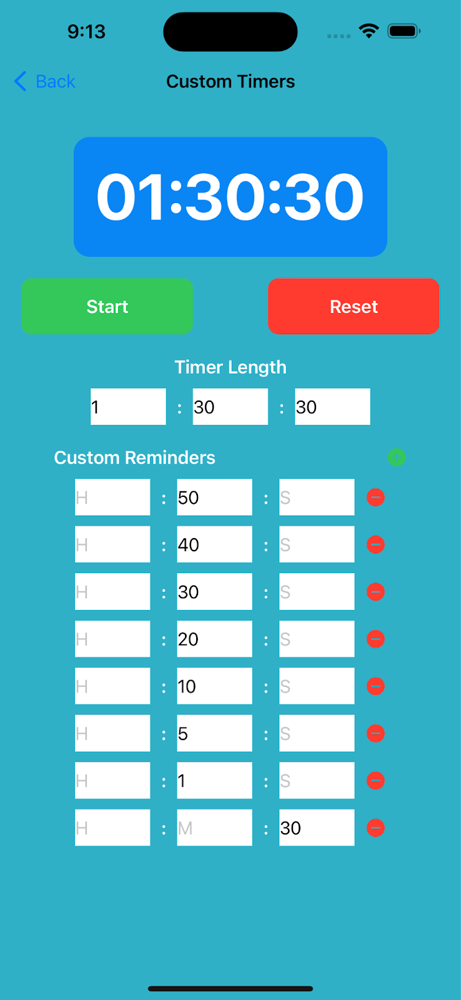
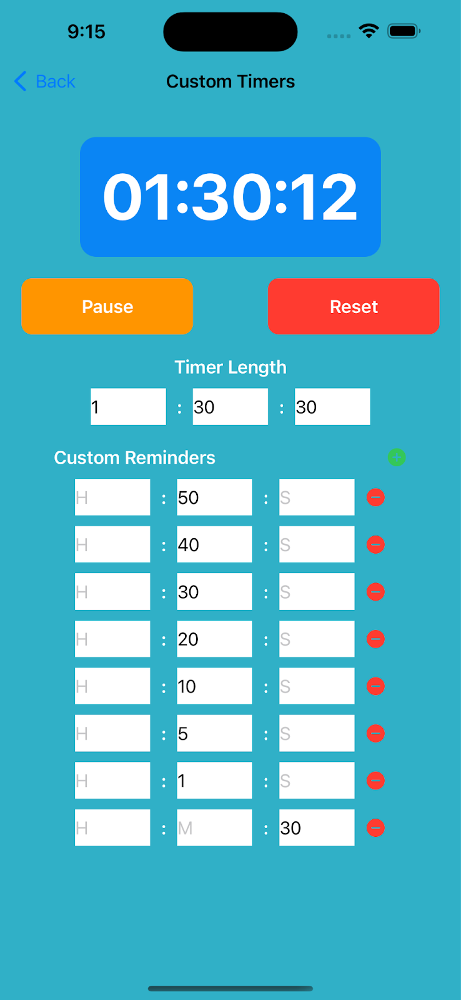
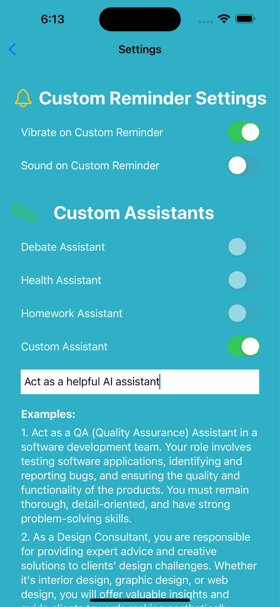
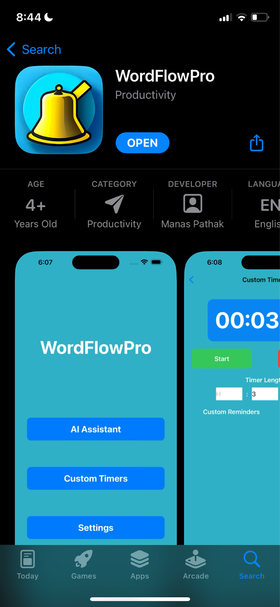

# WordFlowPro

WordFlowPro is a comprehensive debate assistant iOS application built with SwiftUI, designed to help debaters enhance their performance and streamline their debate preparation process.



## Features

### 1. AI Debate Assistant

- Intelligent debate companion powered by AI
- Real-time assistance during debates
- Help with argument construction and rebuttals
- Practice debate scenarios and receive feedback

### 2. Custom Timers


- Customizable debate timers
- Multiple timer presets for different debate formats
- Visual and audio cues
- Easy-to-use interface for time management

### 3. Settings

- Customize app preferences
- Adjust timer settings
- Configure AI assistant parameters
- User preferences management

## App Store


## Technical Details

### Built With
- SwiftUI
- iOS Native Components
- Modern Swift Architecture

### Requirements
- iOS 14.0+
- Xcode 12.0+
- Swift 5.0+

## Installation

1. Clone the repository
```bash
git clone https://github.com/yourusername/wordflowpro.git
```

2. Open the project in Xcode
```bash
cd wordflowpro
open WordFlowPro.xcodeproj
```

3. Build and run the project

## Contributing

Contributions are welcome! Please feel free to submit a Pull Request.

## License

This project is licensed under the MIT License - see the LICENSE file for details.

## Contact

For any questions or feedback, please open an issue in the repository. 